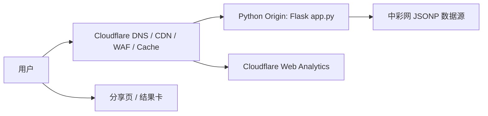

# SSQ Cloudflare 部署、广告变现与病毒增长文档

**日期：** 2026-05-05
**项目：** 双色球玄数双模选号
**结论：** 可以上线并商业化测试，但不要把它当成“彩票预测产品”卖。真正能传播的是“玄学 + 数据 + 晒图”的娱乐仪式感；真正能赚钱的是规模化页面流量和合规广告库存。

## 1. 执行结论

### 1.1 Cloudflare 能不能挂

能，但分两种意思：

| 路线 | 是否适合现在 | 判断 |
| --- | --- | --- |
| 直接把当前 `app.py` 放到 Cloudflare Pages | 不适合 | 当前项目是 Flask 服务端应用，Pages 主要适合静态站；Pages Functions 虽然能跑服务端逻辑，但不是直接运行 Flask 服务器。 |
| Cloudflare 做域名/CDN/WAF，Flask 跑在一个轻量 Python Origin 上 | 最推荐的第一阶段 | 代码几乎不用改，最快验证流量、广告、分享率。 |
| 改写为 Cloudflare Python Worker | 可行但要重构 | Python Workers 仍标记 beta，需要 `fetch` 入口、`pywrangler`、异步 HTTP 客户端，且当前回测计算要适配 Workers CPU/内存限制。 |
| 静态 Pages + Worker API + KV/D1 缓存 | 推荐的第二阶段 | 前端静态化，API 边缘化，开奖和回测结果缓存化，长期更省成本和更容易抗流量。 |

**推荐路线：** 先用 Cloudflare 做门面，后面挂一个最小 Python Origin；等验证到真实自然流量后，再决定是否把核心 API 改成 Worker。

### 1.2 能不能靠页面广告赚钱

能，但不能幻想一上线就有钱。广告收入是流量游戏，不是代码游戏。

这个项目会碰到三个现实问题：

1. 彩票主题天然接近在线赌博广告限制边界。
2. AdSense 对无效流量非常敏感，病毒传播如果变成刷量、诱导点击、互点广告，会直接损害账号。
3. 单页工具如果没有内容页、分享页、开奖页和解释页，广告库存太薄，页面价值低。

所以正确变现模型不是“工具页塞广告”，而是：

```text
可分享工具页 + 每期开奖内容页 + 历史数据解释页 + 结果分享页 + 合规广告位
```

### 1.3 怎么病毒式地推

不要推“预测中奖”。要推“今天你的玄数票型是什么”“差一个红球有多离谱”“用生日生成一张可以晒的娱乐卡”。

传播物必须是结果卡，不是产品说明：

- 一键生成分享图。
- 分享图不暴露完整生日。
- 开奖后自动生成“命中复盘卡”。
- 每天一张“冷热号 + 玄数偏置”榜单。
- 每期一个可索引的开奖复盘页。

## 2. 当前项目事实

当前项目是一个单文件 Flask 应用：

- `app.py` 使用 `Flask` 和 `render_template_string` 输出完整 HTML。
- `requirements.txt` 只有 `Flask` 和 `lunar-python`。
- 开奖数据通过 `urllib.request.urlopen` 请求中彩网 JSONP 接口。
- 本地内存缓存开奖数据 30 分钟。
- 默认表单会跑 60 期回测、72 轮参数覆盖，再生成号码。
- README 已明确声明彩票是随机事件，工具仅用于娱乐、学习和数据实验。

这些事实决定了部署策略：

- 原样迁移到普通 Python Web 环境最简单。
- 原样迁移到 Cloudflare Worker 不现实，需要重构入口、HTTP 请求方式、模板渲染和缓存。
- 当前回测计算偏重，不能按 Cloudflare Free Worker 的 10ms CPU 预算设计。

## 3. 官方事实核对

| 事实 | 来源 | 对本项目的影响 |
| --- | --- | --- |
| Cloudflare Python Workers 支持 Python、FastAPI、httpx、Pydantic 等包，但 Python Workers 仍处于 beta，需要 `python_workers` compatibility flag，并使用 `pywrangler` 部署。 | https://developers.cloudflare.com/workers/languages/python/ | 可以重写成 Python Worker，但不应当假设 Flask 原样可跑。 |
| Python Workers 的主入口是 `fetch` handler。 | https://developers.cloudflare.com/workers/languages/python/ | 当前 Flask `app.run()` 模式需要改。 |
| Python Workers 支持 pure Python 包和 Pyodide 包；HTTP 客户端需要异步库，例如 `aiohttp` 或 `httpx`，也可通过 FFI 调用 JavaScript `fetch()`。 | https://developers.cloudflare.com/workers/languages/python/packages/ | 当前 `urllib.request.urlopen` 需要替换。 |
| Python Workers 基于 Pyodide；`sockets`、`threading`、`multiprocessing` 等存在限制或不可用。 | https://developers.cloudflare.com/workers/languages/python/stdlib/ | 不能按传统 Python 服务器心智部署。 |
| Workers Free 单次 HTTP 请求 CPU 限制为 10ms；Paid 默认 30s，可提高到 5 分钟；内存每 isolate 128MB；Free 每日 100,000 请求。 | https://developers.cloudflare.com/workers/platform/limits/ | 当前回测不能走 Free Worker；即使用 Paid，也要缓存、预计算、限流。 |
| Cloudflare Pages Functions 在 Cloudflare 网络上用 Workers 执行服务端代码，不需要专用服务器。 | https://developers.cloudflare.com/pages/functions/ | 可以作为全栈架构的一部分，但不是直接上传 Flask。 |
| Google Publisher Restrictions 覆盖在线真钱赌博相关内容；受限制库存可能获得更少广告需求，甚至无广告。 | https://support.google.com/adsense/answer/10437795 | 本项目必须避免在线购买彩票、投注平台、赌博 affiliate 和中奖承诺。 |
| AdSense 禁止人工或自动方式膨胀点击/展示，禁止诱导用户点击广告，也禁止 paid-to-click、autosurf、click exchange 等流量来源。 | https://support.google.com/adsense/answer/48182 和 https://support.google.com/adsense/answer/16737 | 病毒传播只能做真实分享和内容分发，不能设计广告点击激励。 |

## 4. 部署方案

### 4.1 阶段一：Cloudflare 前门 + Python Origin

**目标：** 1-2 天上线，验证是否有人用、是否分享、是否能被广告平台接受。

架构：



建议 Origin 选择：

- Render、Fly.io、Railway、VPS、PythonAnywhere、容器平台均可。
- 先不要追求全 Cloudflare。先把商业假设跑通。

必须补的工程项：

- 增加 `robots.txt`、`sitemap.xml`。
- 增加 `/privacy`、`/terms`、`/disclaimer`。
- 增加 Cloudflare Web Analytics 或等价统计。
- POST 生成接口加频率限制。
- 高风险流量加 Cloudflare Turnstile。
- 结果页和分享页不要把广告放在“生成”“分享”“复制号码”等强交互按钮旁边。

### 4.2 阶段二：静态页面 + API 分离

**目标：** 把广告库存和传播页做出来，同时减少服务端压力。

拆法：

| 模块 | 处理方式 |
| --- | --- |
| 首页、开奖页、解释文章、分享页 | Cloudflare Pages 或 Workers Static Assets |
| 生成号码 API | Python Origin 或 Worker API |
| 开奖数据缓存 | Cloudflare KV / Cache API / Origin 内存缓存 |
| 每期开奖复盘 | 定时任务生成静态 Markdown/HTML |
| 分享卡图片 | Origin 生成 PNG，或前端 Canvas 生成 |

这一阶段的关键不是技术炫技，而是页面资产：

- `/draws/latest`
- `/draws/2026048`
- `/tools/ssq-generator`
- `/learn/ssq-odds`
- `/learn/randomness-vs-backtest`
- `/daily/2026-05-05-hot-cold`
- `/share/<share_id>`

### 4.3 阶段三：Cloudflare Python Worker 重构

**目标：** 当自然流量证明值得继续时，把核心 API 边缘化。

重构清单：

- 把 `app.py` 拆成纯计算模块和 Web 入口模块。
- 将 Flask 路由改为 Worker `fetch` handler，或使用 FastAPI Worker 模板。
- 用 `httpx` / `aiohttp` / JS `fetch()` 替换 `urllib.request.urlopen`。
- 将 HTML 模板拆为静态前端，API 只返回 JSON。
- 将开奖数据存 KV/D1，定时同步，避免每个用户触发抓取。
- 将默认回测改为缓存结果或渐进式计算，避免每个请求完整跑 72 轮。
- 使用 Workers Paid，并设置合理 `cpu_ms` 上限。

进入阶段三的门槛：

- 7 日自然访问量超过 30,000 sessions。
- 分享页访问占比超过 20%。
- 单次生成 P95 耗时低于 8 秒，或有明确缓存方案。
- AdSense 或替代广告网络完成初审。

## 5. 广告变现模型

### 5.1 收入公式

```text
MonthlyRevenue = PageViews / 1000 * PageRPM
```

其中：

- `PageViews = Sessions * PagesPerSession`
- `PageRPM` 受广告平台、地区、内容限制、广告位质量和流量质量影响。
- 下表是规划假设，不是市场报价。

| 场景 | 月 sessions | 页/session | 月 PV | 假设 Page RPM | 月收入 | 判断 |
| --- | ---: | ---: | ---: | ---: | ---: | --- |
| 玩具流量 | 20,000 | 1.2 | 24,000 | $0.20 | $4.80 | 没商业意义，只能验证使用行为。 |
| 小工具站 | 250,000 | 1.6 | 400,000 | $0.60 | $240 | 可以覆盖基础托管，不能当主业。 |
| 内容 + 分享跑通 | 2,000,000 | 2.0 | 4,000,000 | $1.20 | $4,800 | 有继续投入价值。 |
| 真正爆发 | 10,000,000 | 2.2 | 22,000,000 | $1.50 | $33,000 | 需要强风控、缓存和多广告源。 |

### 5.2 广告位原则

允许做：

- 结果区下方一个原生广告位。
- 开奖复盘文章中段一个广告位。
- 页底一个广告位。
- 分享页轻广告，优先保证打开速度和分享体验。

不要做：

- 广告贴着“生成号码”“分享”“复制”按钮。
- 弹窗广告、误触广告、伪装成号码结果的广告。
- “点广告支持本站”。
- “分享后解锁更准号码”。
- 刷量、互点、买低质流量。

### 5.3 合规定位

页面必须坚持：

- 娱乐和数据实验定位。
- 不售卖彩票。
- 不导流到购彩平台。
- 不承诺中奖。
- 不展示“稳赚”“必中”“内部模型”等误导文案。
- 不保存用户生日，或明确说明保存范围和用途。
- 分享卡默认隐藏完整生日，只保留用户主动选择展示的信息。

## 6. 病毒增长策略

### 6.1 增长本质

这个项目不是靠理性价值传播，而是靠三个心理按钮传播：

1. **身份感：** “我的生日/八字生成的号码长这样。”
2. **戏剧性：** “差一个红球是什么体验。”
3. **社交比较：** “你和朋友谁的玄数票型更离谱。”

所以主传播物不是链接，而是图片。

### 6.2 必做病毒资产

| 资产 | 机制 | MVP |
| --- | --- | --- |
| 生成结果分享卡 | 用户生成后立刻可晒 | 展示 5 注号码、五行偏向、风险免责声明、站点短链。 |
| 开奖后复盘卡 | 每期开奖后用户回来对结果 | 显示命中红球数、蓝球命中、最佳一注、不要写“可惜差点暴富”。 |
| 每日冷热榜 | 给内容平台稳定素材 | 生成“近 200 期热号/冷号/遗漏榜”。 |
| 生日票型标签 | 强化身份传播 | 例如“木火偏旺型”“纯统计保守型”“蓝球执念型”。 |
| 朋友对比页 | 拉新 | 两个人各生成一张卡，对比结构，不涉及合买或下注。 |
| 开奖复盘长图 | 小红书、朋友圈、社群可转发 | 每期一张，不夸预测能力，只讲历史模拟和随机性。 |

### 6.3 渠道打法

| 渠道 | 主要内容 | CTA | 成功指标 |
| --- | --- | --- | --- |
| 小红书 | “生日生成双色球娱乐卡”“开奖差一球复盘” | 生成我的卡 | 收藏率、分享率、站外点击 |
| 抖音/视频号 | 15 秒开奖复盘、冷热号榜 | 评论生日月份/访问链接 | 完播率、主页点击 |
| B站 | “随机性 vs 回测”的反直觉解释 | 看工具演示 | 搜索流量、长尾收藏 |
| 微信群/朋友圈 | 分享卡 | 生成你的版本 | 分享页打开率 |
| Google/百度 SEO | 开奖页、随机性科普、工具页 | 免费生成 | 搜索点击、PV/session |
| Reddit/X/中文论坛 | “I built a weird lottery astrology stats toy” | Try it | 海外中文流量、反馈 |

### 6.4 裂变指标

```text
K = ShareRate * ClicksPerShare * NewUserConversion
```

初期目标：

- 生成完成率：40% 以上。
- 分享率：8% 以上。
- 每次分享带来点击：1.5 以上。
- 分享点击后的生成转化：20% 以上。
- 初始 K 值：0.024 以上即可继续优化；0.1 以上说明传播资产开始有效。

真正病毒式增长需要 K 接近或超过 1。这个项目短期不应幻想 K > 1，先追“分享页带来自然新增”。

### 6.5 48 小时验证实验

**目标：** 判断这个项目是否有传播价值。

交付：

1. 一个可公开访问的工具页。
2. 一个生成后可复制/下载的分享卡。
3. 一个 `/share/<id>` 分享页。
4. 三篇内容页：
   - “双色球到底能不能预测”
   - “近 200 期冷热号榜”
   - “回测为什么容易骗人”
5. 基础统计事件：
   - `view_home`
   - `submit_generate`
   - `generate_success`
   - `click_share`
   - `view_share`
   - `return_after_draw`

通过标准：

- 200 个真实访问中，至少 60 次生成。
- 至少 10 次分享行为。
- 分享页带来至少 15 个新增访问。
- 平均页面停留超过 35 秒。
- 没有用户误解为“保证中奖”。

失败标准：

- 大部分用户只看一眼就走。
- 没人愿意分享结果卡。
- 评论区集中质疑“骗人”“割韭菜”。
- 广告平台审核明显卡在赌博/低价值内容。

## 7. 内容与 SEO 计划

### 7.1 页面类型

| 页面 | 目的 | 更新频率 |
| --- | --- | --- |
| 工具首页 | 转化生成 | 常驻 |
| 最新开奖页 | 搜索入口 | 每期开奖后 |
| 历史期号页 | 长尾搜索 | 每期开奖后新增 |
| 冷热号榜 | 社交内容素材 | 每天 |
| 回测解释页 | 建信任 | 常驻，每月更新 |
| 随机性科普页 | 降低合规风险 | 常驻 |
| 分享页 | 裂变入口 | 用户生成 |

### 7.2 内容原则

- 每篇必须有原创数据、截图、表格或解释，不要薄内容堆关键词。
- 彩票主题要反复强调随机性，避免预测承诺。
- 把产品说成“娱乐工具”和“数据实验”，不要说成“彩票软件”。
- 标题可以有钩子，但正文必须稳。

示例标题：

- “双色球近 200 期冷热号：热不代表下一期更容易出”
- “为什么彩票回测很容易骗人”
- “用生日生成双色球号码，娱乐可以，别当投资”
- “本期双色球复盘：蓝球命中到底值不值得激动”

## 8. 产品改造需求

### P0：上线前

- 增加公开免责声明页。
- 增加隐私页，说明生日和生成结果是否保存。
- 增加分享卡生成。
- 增加基础埋点。
- 增加 rate limit / Turnstile。
- 增加 robots/sitemap。
- 调整首页文案，弱化“预测”，强化“娱乐 + 数据实验”。

### P1：增长验证

- 新增 `/share/<id>`。
- 新增最新开奖页。
- 新增冷热号榜页。
- 新增开奖后复盘卡。
- 增加 canonical URL 和 Open Graph 图片。
- 结果页首屏优化，移动端分享按钮明显。

### P2：边缘化和规模化

- 静态前端 + JSON API。
- 开奖数据落 KV/D1。
- 回测结果按日期、参数和生日匿名特征缓存。
- Worker 化核心轻 API。
- Origin 只承担重计算和图片生成。
- 广告源从 AdSense 扩展到多网络或直客赞助。

## 9. 风险表

| 风险 | 严重度 | 处理 |
| --- | --- | --- |
| 被理解成中奖承诺 | 高 | 文案、分享卡、结果页都加随机性与娱乐定位。 |
| 广告平台判定为赌博相关低需求 | 高 | 不售票、不导流、不做 affiliate；准备替代广告源和赞助。 |
| 病毒流量触发无效流量风控 | 高 | 禁止诱导点击广告；限流；过滤异常来源；广告加载与分享动作隔离。 |
| Worker CPU 超限 | 中 | 阶段一先用 Origin；阶段三前做 benchmark 和缓存。 |
| 中彩网接口变化 | 中 | 缓存最近数据；准备手动导入或备用数据源。 |
| 用户隐私争议 | 中 | 默认不保存生日；分享卡隐藏完整生日。 |
| 内容太薄，SEO 无效 | 中 | 每期开奖生成真实复盘和数据表，不堆重复页。 |

## 10. 推荐决策

### 立刻做

1. 不重写 Cloudflare Worker，先用 Cloudflare + Python Origin 上线。
2. 做分享卡和分享页。
3. 做三类内容页：开奖页、冷热榜、随机性科普。
4. 暂缓大规模广告；先接统计，验证真实传播。
5. 等有自然流量后再申请/接入广告。

### 不做

1. 不做购买彩票链接。
2. 不做合买、跟单、付费预测。
3. 不买垃圾流量。
4. 不诱导点击广告。
5. 不把“回测高”包装成“下一期更准”。

### 最高杠杆下一步

做一个公开可访问的 MVP：

- Cloudflare 域名和安全层。
- 原 Flask 服务运行在便宜 Python Origin。
- 首页可生成。
- 生成后可下载分享卡。
- 分享卡打开到 `/share/<id>`。
- 埋点记录访问、生成、分享、分享页转化。

然后用 48 小时实验决定这个项目是继续增长，还是关掉止损。
