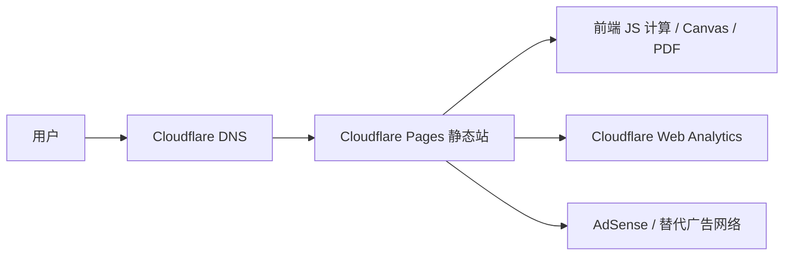
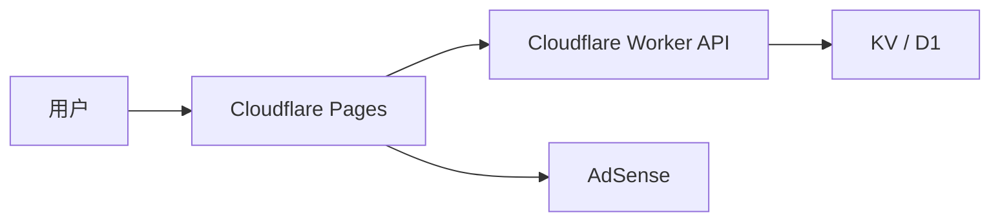

# Cloudflare 工具站选题、广告接入与上线 SOP

**日期：** 2026-05-05
**用途：** 用低价域名、Cloudflare Pages/Workers 和合规广告，把“轻工具 + 长尾内容 + 分享结果”做成可复制的小站工厂。

## 1. 战略边界

这套打法不做广告欺诈，不刷点击，不诱导用户点广告，不买 autosurf / click exchange / paid-to-click 流量。核心是用低成本基础设施批量生产真实有用页面，吃搜索长尾、分享流量和合规广告库存。

推荐公式：

```text
轻工具 + 长尾 SEO 页面 + 可下载/分享结果 + 合规广告位 + 低运维成本
```

否决公式：

```text
AI 水文 + 无工具价值 + 无原创数据 + 强插广告 + 垃圾流量
```

## 2. 选题评分

### 2.1 评分公式

```text
Score = 0.22 * 搜索意图
      + 0.18 * 广告价值
      + 0.16 * 静态化程度
      + 0.14 * 页面规模
      + 0.12 * 分享性
      + 0.10 * 合规安全
      + 0.08 * 可转付费
```

每项 1-5 分。低于 3.6 不做；高于 4.1 进入 48 小时 MVP。

### 2.2 候选方向

| 排名 | 方向 | 搜索意图 | 广告价值 | 静态化 | 分享性 | 合规 | 总评 | 结论 |
| --- | --- | ---: | ---: | ---: | ---: | ---: | ---: | --- |
| 1 | 装修/家居计算器 | 5 | 5 | 5 | 3 | 4 | 4.56 | 第一优先级 |
| 2 | 教育练习纸生成器 | 5 | 4 | 5 | 4 | 5 | 4.52 | 第一优先级 |
| 3 | 小商家工具箱 | 4 | 4 | 5 | 4 | 5 | 4.28 | 第二优先级 |
| 4 | 简历/面试工具 | 5 | 5 | 4 | 3 | 4 | 4.24 | 第二优先级，竞争更强 |
| 5 | 节日祝福/海报生成器 | 4 | 3 | 5 | 5 | 5 | 4.16 | 节日爆发型 |
| 6 | 生日玄学娱乐卡 | 3 | 3 | 5 | 5 | 4 | 3.84 | 可复用现有逻辑，适合做流量实验 |
| 7 | 职场黑话翻译器 | 3 | 3 | 5 | 5 | 5 | 3.78 | 病毒强，SEO 弱 |
| 8 | 彩票/博彩工具 | 4 | 2 | 4 | 3 | 1 | 2.90 | 不作为主线 |

## 3. 推荐 MVP：装修计算器三件套

先做一个窄站，不做大而全。

### 3.1 首批工具

| 工具 | URL | 输入 | 输出 | 分享资产 |
| --- | --- | --- | --- | --- |
| 刷漆计算器 | `/tools/paint-calculator` | 房间长宽高、门窗面积、涂刷遍数、单桶覆盖面积 | 墙面面积、漆量、桶数、预算区间 | 装修预算卡 |
| 瓷砖计算器 | `/tools/tile-calculator` | 房间面积、砖尺寸、损耗比例 | 砖数、箱数、损耗量、预算区间 | 采购清单卡 |
| 窗帘尺寸计算器 | `/tools/curtain-calculator` | 窗宽、窗高、褶皱倍数、落地方式 | 布宽、布高、杆长建议 | 尺寸建议卡 |

### 3.2 首批内容页

| 页面 | URL | 目的 |
| --- | --- | --- |
| 刷漆要买多少乳胶漆 | `/guides/how-much-paint` | 吃搜索长尾，导向工具 |
| 瓷砖损耗率怎么算 | `/guides/tile-waste-rate` | 解释参数，提高页面质量 |
| 窗帘 1.5 倍和 2 倍褶皱区别 | `/guides/curtain-fullness` | 解决真实购买问题 |
| 装修预算常见漏项 | `/guides/renovation-budget-mistakes` | 提升广告价值 |
| 小户型刷漆预算 | `/guides/small-room-paint-budget` | 场景长尾 |
| 卫生间瓷砖采购清单 | `/guides/bathroom-tile-checklist` | 场景长尾 |

### 3.3 成功标准

48 小时内先不看广告收入，看行为：

- 300 个真实访问。
- 工具完成率 35% 以上。
- 结果卡下载/分享率 5% 以上。
- 平均停留 45 秒以上。
- 搜索页面被正常抓取。
- 没有用户反馈计算结果明显不可信。

## 4. 推荐技术架构

### 4.1 无后端版本

适合装修、教育、节日卡、小商家模板。



优点：

- 成本最低。
- 运维最少。
- Cloudflare Pages 足够托管 HTML/CSS/JS。
- 广告和 SEO 页面容易上线。

缺点：

- 不能做重计算。
- 不能保存用户数据，除非额外接 KV/D1/后端。

### 4.2 轻 API 版本

适合需要分享页、短链、图片生成、排行榜的小站。



使用边界：

- Worker 只做轻 API：创建分享 ID、读取分享数据、返回 JSON。
- 图片优先前端 Canvas 生成；需要服务端图再上 Worker/Origin。
- 重计算放 Origin 或预计算任务。

## 5. 仓库结构 SOP

推荐结构：

```text
tool-site/
  public/
    ads.txt
    robots.txt
    sitemap.xml
    _headers
    _redirects
  src/
    tools/
      paint-calculator/
      tile-calculator/
      curtain-calculator/
    guides/
    components/
      AdSlot.*
      ShareCard.*
      CalculatorLayout.*
    lib/
      analytics.*
      calculators.*
      seo.*
  package.json
  wrangler.toml
```

纯静态也可以不用框架：

```text
public/
  index.html
  tools/paint-calculator/index.html
  guides/how-much-paint/index.html
  assets/site.css
  assets/app.js
  ads.txt
  robots.txt
  sitemap.xml
```

## 6. 上线前页面清单

AdSense 审站前至少准备：

- 首页。
- 3 个可用工具页。
- 6-10 篇原创解释页。
- `/about`。
- `/contact`。
- `/privacy`。
- `/terms`。
- `/disclaimer`。
- `robots.txt`。
- `sitemap.xml`。
- 无死链。
- 移动端可用。
- 没有空模板、占位文字、重复低质页。

## 7. 广告接入 SOP

### 7.1 审站前

1. 先上线完整站点，不要拿空壳申请。
2. 每个工具必须能正常输出结果。
3. 每篇内容页要有实际计算解释、参数表或示例，不要 AI 水文堆字。
4. 页脚放隐私、条款、联系入口。
5. 不要放任何诱导点击文案。
6. 不要把广告放在按钮附近或伪装成工具结果。

### 7.2 AdSense 申请与站点添加

1. 注册或进入 AdSense。
2. 添加站点域名，例如 `example.com`。
3. 按后台提示把 AdSense 代码放到页面 `<head>`。
4. 等待站点审核。
5. 审核期间保持页面可访问，不频繁大改结构。

示例 `<head>` 代码：

```html
<script
  async
  src="https://pagead2.googlesyndication.com/pagead/js/adsbygoogle.js?client=ca-pub-XXXXXXXXXXXXXXXX"
  crossorigin="anonymous"></script>
```

把 `ca-pub-XXXXXXXXXXXXXXXX` 换成自己的 publisher ID。

### 7.3 ads.txt

在站点根目录提供：

```text
google.com, pub-XXXXXXXXXXXXXXXX, DIRECT, f08c47fec0942fa0
```

上线后必须能通过下面地址访问：

```text
https://example.com/ads.txt
```

### 7.4 广告位策略

第一版只放 2-3 个位置：

| 位置 | 页面 | 说明 |
| --- | --- | --- |
| 内容中段 | 指南页 | 第一段正文之后，不影响阅读 |
| 结果下方 | 工具页 | 结果展示完成后再出现 |
| 页底 | 全站 | 保守位置，降低误触 |

不要放：

- 首屏遮挡式广告。
- 弹窗广告。
- 粘着“计算”“下载”“复制”“分享”按钮的广告。
- 伪装成推荐结果的广告。
- 引导点击广告的文案。

手动广告位示例：

```html
<ins
  class="adsbygoogle"
  style="display:block"
  data-ad-client="ca-pub-XXXXXXXXXXXXXXXX"
  data-ad-slot="YYYYYYYYYY"
  data-ad-format="auto"
  data-full-width-responsive="true"></ins>
<script>
  (adsbygoogle = window.adsbygoogle || []).push({});
</script>
```

### 7.5 广告上线后的风控

每天检查：

- CTR 是否异常飙升。
- 单一来源流量是否异常集中。
- 跳出率和停留时间是否失真。
- 是否有大量同 IP、同 UA、同 referrer 流量。
- 是否有用户反馈广告误触。

出现异常时：

1. 先移除高风险广告位。
2. Cloudflare 开启 Bot Fight Mode / WAF 规则。
3. 对异常来源加挑战或限流。
4. 暂停可疑付费投放。
5. 不要自己点广告测试。

## 8. Cloudflare 上线 SOP

### 8.1 购买域名

选域名规则：

- 不碰商标。
- 不用太长的拼音堆叠。
- 用 `.com`、`.net`、`.org`、`.fun`、`.tools`、`.site` 都可以。
- 工具站优先可扩展品牌名，不要单一工具名。

例子：

```text
homecalc.tools
tinyworksheet.com
paperkit.fun
budgetprint.site
```

### 8.2 接入 Cloudflare DNS

1. 在 Cloudflare 添加站点。
2. 按提示把域名 nameserver 改到 Cloudflare。
3. 等 DNS 激活。
4. SSL/TLS 设为 Full 或 Full Strict。
5. 开启 Always Use HTTPS。

### 8.3 部署 Cloudflare Pages：Git 集成

推荐 Git 集成，适合长期维护。

1. 代码推到 GitHub。
2. Cloudflare Dashboard 进入 Workers & Pages。
3. 创建 Pages 项目。
4. 连接 GitHub 仓库。
5. 设置构建参数：

| 项目类型 | Build command | Output directory |
| --- | --- | --- |
| 纯静态 | 留空 | `public` |
| Vite | `npm run build` | `dist` |
| Astro | `npm run build` | `dist` |
| Next 静态导出 | `npm run build` | `out` |

6. 点击 Deploy。
7. 部署成功后先访问 `*.pages.dev` 测试。

### 8.4 部署 Cloudflare Pages：Wrangler 直传

适合纯静态小站或快速实验。

```bash
npm install -g wrangler
wrangler login
wrangler pages project create homecalc-tools
wrangler pages deploy public --project-name=homecalc-tools
```

如果是 Vite/Astro：

```bash
npm install
npm run build
wrangler pages deploy dist --project-name=homecalc-tools
```

### 8.5 绑定自定义域名

1. 进入 Pages 项目。
2. 打开 Custom domains。
3. 添加 `example.com`。
4. 添加 `www.example.com`。
5. 检查 DNS 记录自动创建。
6. 等证书生效。
7. 设置 canonical 域名，避免 `www` 和裸域重复收录。

### 8.6 基础文件

`robots.txt`：

```text
User-agent: *
Allow: /

Sitemap: https://example.com/sitemap.xml
```

`sitemap.xml` 至少包含首页、工具页、指南页：

```xml
<?xml version="1.0" encoding="UTF-8"?>
<urlset xmlns="http://www.sitemaps.org/schemas/sitemap/0.9">
  <url>
    <loc>https://example.com/</loc>
  </url>
  <url>
    <loc>https://example.com/tools/paint-calculator</loc>
  </url>
</urlset>
```

`_headers`：

```text
/*
  X-Content-Type-Options: nosniff
  Referrer-Policy: strict-origin-when-cross-origin
  Permissions-Policy: camera=(), microphone=(), geolocation=()
```

`_redirects`：

```text
http://example.com/* https://example.com/:splat 301
https://www.example.com/* https://example.com/:splat 301
```

## 9. 埋点 SOP

最低限度埋这些事件：

| 事件 | 触发时机 | 参数 |
| --- | --- | --- |
| `view_home` | 首页加载 | referrer, path |
| `view_tool` | 工具页加载 | tool_id |
| `calculate_start` | 点击计算 | tool_id |
| `calculate_success` | 得到结果 | tool_id, input_bucket |
| `download_result` | 下载图片/PDF | tool_id |
| `share_click` | 点击分享 | tool_id, channel |
| `view_guide` | 指南页加载 | slug |
| `ad_slot_view` | 广告位进入视口 | slot_id |

首选：

- Cloudflare Web Analytics 看基础访问。
- Plausible / Umami / PostHog 看事件。
- Search Console 看搜索抓取。

## 10. 发布检查表

### 10.1 每次上线前

- 首页能打开。
- 3 个核心工具能计算。
- 移动端没有文字溢出。
- 结果图/PDF 能下载。
- 所有导航链接可用。
- `/privacy`、`/terms`、`/contact` 存在。
- `/robots.txt` 可访问。
- `/sitemap.xml` 可访问。
- `/ads.txt` 可访问。
- 页面源代码里能看到 AdSense client ID。
- 广告位不贴近按钮。
- Lighthouse 没有明显性能问题。

### 10.2 上线后 24 小时

- Cloudflare Analytics 有访问。
- Search Console 能提交 sitemap。
- AdSense 没有 policy warning。
- 没有异常 CTR。
- 没有异常来源集中。
- 工具计算没有用户反馈错误。
- 记录访问、生成、分享、下载四个指标。

## 11. 日常运营 SOP

### 每天

- 发布 1 个指南页或 1 个场景页。
- 更新 1 张可分享图。
- 检查广告异常。
- 检查 Cloudflare 错误率。

### 每周

- 看 Search Console 查询词，补 5 个长尾页面。
- 看最高流量页，把 CTA 改得更清楚。
- 看最低完成率工具，修输入体验。
- 看广告位表现，移除误触风险高的位置。

### 每月

- 扩 1 个工具。
- 做 1 个模板包。
- 测 1 个新渠道。
- 复盘收入、PV、RPM、分享率、搜索曝光。

## 12. 不同方向的首批页面模板

### 12.1 装修计算器

```text
/tools/paint-calculator
/tools/tile-calculator
/tools/curtain-calculator
/guides/how-much-paint
/guides/tile-waste-rate
/guides/curtain-fullness
/guides/renovation-budget-mistakes
```

### 12.2 教育练习纸

```text
/tools/math-worksheet-generator
/tools/hanzi-practice-sheet
/tools/spelling-quiz-generator
/worksheets/grade-2-addition-within-100
/worksheets/multiplication-table-practice
/guides/how-to-practice-mental-math
```

### 12.3 小商家工具箱

```text
/tools/quote-maker
/tools/menu-poster-maker
/tools/price-tag-generator
/tools/inventory-label-maker
/guides/how-to-make-a-simple-quote
/guides/small-shop-menu-template
```

### 12.4 玄学娱乐卡

```text
/tools/birthday-keyword-card
/tools/lucky-color-card
/tools/name-element-card
/share/<id>
/guides/five-elements-for-fun
/guides/why-entertainment-tools-are-not-predictions
```

## 13. 48 小时执行剧本

### Day 1

1. 定方向：装修计算器三件套。
2. 买域名。
3. 建 Cloudflare Pages 项目。
4. 做首页、3 个工具页、3 个指南页。
5. 加隐私、条款、联系、免责声明。
6. 加 robots、sitemap、headers、redirects。
7. 加 Cloudflare Web Analytics。

### Day 2

1. 做结果分享图。
2. 补 3 篇指南页。
3. 接 AdSense 审站代码。
4. 配 `ads.txt`。
5. 绑定自定义域名。
6. 提交 Search Console。
7. 发 10 条测试内容到社媒/群/论坛。
8. 记录访问、完成率、分享率。

## 14. 资料来源

- Cloudflare Pages deployment: https://developers.cloudflare.com/pages/
- Cloudflare Pages custom domains: https://developers.cloudflare.com/pages/configuration/custom-domains/
- Cloudflare Pages Direct Upload / Wrangler: https://developers.cloudflare.com/pages/get-started/direct-upload/
- Cloudflare Workers limits: https://developers.cloudflare.com/workers/platform/limits/
- Google AdSense add site: https://support.google.com/adsense/answer/12169212
- Google AdSense code placement: https://support.google.com/adsense/answer/9274516
- Google AdSense ads.txt guide: https://support.google.com/adsense/answer/12171612?hl=en-GB
- Google AdSense invalid traffic: https://support.google.com/adsense/answer/16737
- Google traffic source policy: https://support.google.com/adsense/answer/48182
- Google Search spam policies: https://developers.google.com/search/docs/essentials/spam-policies
- Google people-first content guidance: https://developers.google.com/search/docs/fundamentals/creating-helpful-content
